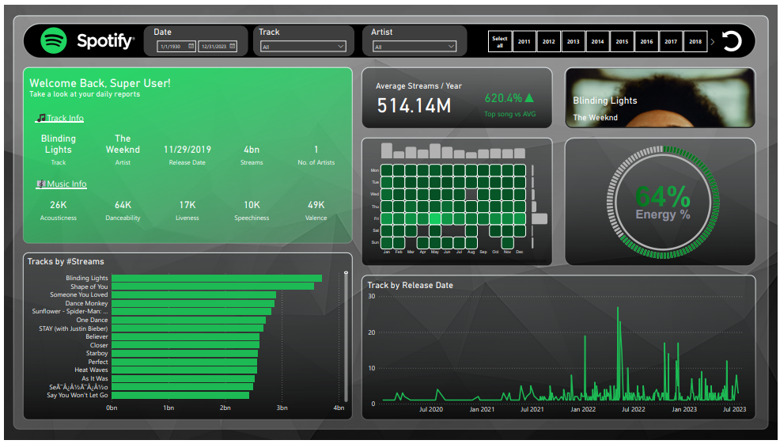

# Power BI Project - Dashboard
## Most Streamed Spotify Songs 2023

### Overview: 👀

### This dataset contains a comprehensive list of the most famous songs of 2023 as listed on Spotify. The dataset offers a wealth of features beyond what is typically available in similar datasets. It provides insights into each song's attributes, popularity, and presence on various music platforms. The dataset includes information such as <b>track name, artist(s) name, release date, Spotify playlists and charts, streaming statistics, Apple Music presence, Deezer presence, Shazam charts, and various audio features</b>.

Check the two files for the complete project overview

<ul>
  <li>Data Cookies.pbix</li>
  <li>Spotify Dataset (NEW).xlsx</li>
</ul>

### Features: 👀
<ul>
  <li>track_name: Name of the song</li>
  <li>artist(s)_name: Name of the artist(s) of the song</li>
  <li>artist_count: Number of artists contributing to the song</li>
  <li>released_year: Year when the song was released</li>
  <li>released_month: Month when the song was released</li>
  <li>released_day: Day of the month when the song was released</li>
  <li>in_spotify_playlists: Number of Spotify playlists the song is included in</li>
  <li>in_spotify_charts: Presence and rank of the song on Spotify charts</li>
  <li>streams: Total number of streams on Spotify</li>
  <li>in_apple_playlists: Number of Apple Music playlists the song is included in</li>
  <li>in_apple_charts: Presence and rank of the song on Apple Music charts</li>
  <li>in_deezer_playlists: Number of Deezer playlists the song is included in</li>
  <li>in_deezer_charts: Presence and rank of the song on Deezer charts</li>
  <li>in_shazam_charts: Presence and rank of the song on Shazam charts</li>
  <li>bpm: Beats per minute, a measure of song tempo</li>
  <li>key: Key of the song</li>
  <li>mode: Mode of the song (major or minor)</li>
  <li>danceability_%: Percentage indicating how suitable the song is for dancing</li>
  <li>valence_%: Positivity of the song's musical content</li>
  <li>energy_%: Perceived energy level of the song</li>
  <li>acousticness_%: Amount of acoustic sound in the song</li>
  <li>instrumentalness_%: Amount of instrumental content in the song</li>
  <li>liveness_%: Presence of live performance elements</li>
  <li>speechiness_%: Amount of spoken words in the song</li>
</ul>
